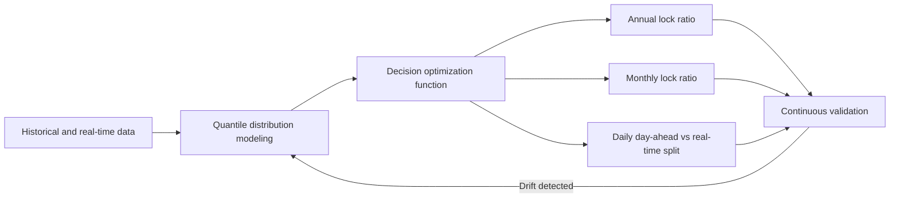
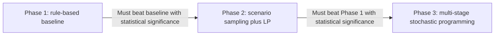
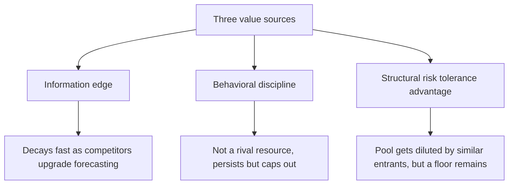

# 电力采购决策优化:从方案设计到博弈本质的思考

## 一、问题背景

化工装置 24 小时连续运行,用电量几乎是常数。电价涨了不能停机,跌了也不会增产。但电费波动直接吞噬利润。

企业每笔购电决策都发生在多个时间点,每个决策本质上是同一个问题的不同尺度版本:**当前已知价格下,锁多少量?留多少给后续市场?**

| 决策时刻 | 锁定什么           | 当时未知的是什么                     |
| -------- | ------------------ | ------------------------------------ |
| 每年 Q4  | 下一年度长协比例   | 明年 12 个月的月度价、日前价、实时价 |
| 每月中旬 | 下月度合同比例     | 下月每天 96 时段的日前价、实时价     |
| 每天     | 次日 96 时段日前量 | 实时价                               |

锁多了,后续市场跌价,多花钱;锁少了,后续市场涨价,暴露在风险中。这不是"预测电价"的问题,预测是手段,决策是目的——衡量标准不是预测误差,是电费有没有省下来。

这件事值得做的三个理由:供给侧变量(风光出力、天气、负荷)是物理变量,因果关系结构性、可建模,不像股票价格由人的预期驱动;电力市场是周期性集中竞价,刚性物理义务的参与者多,没有连续交易机制把规律抹平,套利空间比流动性好的金融市场更容易持续存在;日前与实时市场之间存在结构性风险溢价,承担波动可以换来长期期望回报,这跟保险公司收保费是同一个逻辑。

## 二、数据基础

必须项包括历史日前/实时统一结算点电价、历史年度月度合同报价、天气数据、风光出力数据、联络线计划、负荷数据。补充项包括燃料价格、机组检修计划和政策公告(后者是非结构化文本,需要用 LLM 抽取结构化字段)。

## 三、技术方案:从数据到决策

### 3.1 整体流程

### 3.2 价格分布建模

核心原则是不输出点预测,而是用分位数回归(LightGBM/CatBoost)输出每个时段价格的概率分布(P10/P25/P50/P75/P90)。需要两个模型:日前价格分布模型,和实时溢价(实时价减日前价)分布模型。两者需要用同一特征集同时预测,因为同样的风光预测误差会同时影响两者,独立建模会引入依赖偏差。

### 3.3 决策优化函数

三个决策层(年度/月度/日前)调用同一个函数,输入当前已知锁定价格、未来价格的概率分布、风险偏好参数 λ,目标是 `min (1-λ)·E[成本] + λ·CVaR[成本]`,输出最优锁定比例、期望成本、尾部风险。

### 3.4 求解复杂度:逐档验证

不一步到位用最复杂的方法,每档通过验证才升级:

Phase 1 完全不依赖预测模型,用历史统计定固定比例(如冬季多锁、夏季少锁),如果这个简单规则在回测中都不能统计显著省钱,项目终止。Phase 2 才引入分位数预测和场景采样求解。Phase 3 是嵌套 CVaR 的全局优化,只在 Phase 2 已持续证明增量价值后才投入。

### 3.5 LLM 的角色

LLM 不做数值预测,用在四个地方:从检修公告、政策文件中抽取结构化字段;对政策类文件做"看多/看空/中性"打分作为辅助特征;预测偏离大时自动收集天气、公告、新闻生成可能原因分析;把优化器的数字输出翻译成人能看懂的决策理由。

## 四、产出物与使用方式

系统在三个节点产出建议:年度(每年 Q4)给出锁定比例和分月分配建议(例如报价 280 元/MWh 时建议锁 70%,冬季锁 85%、夏季锁 55%,期望节省约 120 万元,尾部风险不超过 80 万元);月度(每月中旬)给出是否额外锁定月度合同的建议(例如月度报价 300 元高于预测日前均价 280 元,建议不锁);每日给出日前与实时市场的分配建议(例如低温大风天气下,历史相似条件实时溢价均值为负,建议留 20% 给实时市场)。

每一级都是"建议 + 理由",最终决策权在人手里——年度建议用于谈判筹码,月度和日前建议供采购人员参考决策。长期需要每月看验证报告,关注建议与实际决策的电费对比、分位数校准度、漂移检测,分布漂移时系统自动预警。

## 五、如何衡量"没系统"与"有系统"的收益差异

### 5.1 核心难点:无法做真正的对照实验

同一笔电费,不可能既按系统建议锁 70%,又同时按老办法锁 100%,现实只会发生一种情况。必须依赖反事实(counterfactual)方式估算"如果当时用了系统会怎样",而不是真的跑两套平行世界。

### 5.2 先把"现在"定义清楚,再做反事实回测

很多企业说"现在靠经验决策",但这句话太模糊。必须先把现状写成一条可以复现的规则(比如年度锁 100%、或固定比例不分季节),否则后面的对比没有意义。

有了基准规则之后,拿历史数据做 Walk-forward 回测:在每一个历史决策点上,只用当时能拿到的信息生成系统建议(避免偷看未来价格,即避免 look-ahead bias),再用真实发生的历史结算价格算出这个建议对应的实际花费,跟基准规则的花费相减。例如某月合同报价 300 元/MWh,系统当时预测日前市场均价 280 元而建议不锁,事后查实际历史均价确实是 278 元,那么"系统建议"路径的花费用 278 元计,"现状基准"路径的花费用 300 元计,两者相减就是这个月节省的钱。

### 5.3 统计显著性的陷阱

回测期里偶然出现一次极端价格事件,可能让"节省"完全是这一次运气撑起来的。电价数据有很强的时间序列自相关性(今天和明天的价格不是独立的,冬天连续几天都贵),普通 t 检验假设样本独立同分布,会低估真实的不确定性。必须用 Newey-West(HAC)检验,这类方法专门处理自相关数据,才能判断节省的钱是不是统计上稳健的,而不是一次偶然。

### 5.4 分阶段实盘验证

历史回测永远是"事后",哪怕避免了 look-ahead bias,模型在历史数据上调参也有过拟合风险。所以需要在真实未来数据上做三级准出:

| 阶段     | 做什么                       | 怎么衡量                                            |
| -------- | ---------------------------- | --------------------------------------------------- |
| 影子运行 | 系统生成建议但不影响真实决策 | 建议与实际做法两条线并行记录,对比电费差异           |
| 辅助决策 | 人参考系统建议自己拍板       | 跟踪采纳比例和采纳后的实际效果                      |
| 自动执行 | 系统建议直接生效             | 持续跟踪累计节省,对比"如果没有系统会怎样"的虚拟基线 |

每一级至少跑满一个完整季节周期,因为电价规律和天气季节强相关,跑三个月只能覆盖一种季节状态。即便正式上线,也建议在后台持续计算这条虚拟基线,作为长期监控的对照组,而不是验证完就不再过问。

## 六、第二个维度:旧系统与新系统的对比

### 6.1 为什么这是个不同的问题

"没系统 vs 有系统"对比的是两个不同的决策规则在同一段历史上会产生什么结果,核心难点是反事实(两个不同的世界)。"昨天的系统 vs 今天的系统"对比的是换了预测模块后,决策框架本身没变,新旧两个模型都不需要真的拿去执行交易,都可以在同一段真实已发生的市场数据上事后跑一遍,跟同一组真实结算价格对比——这是业界常说的 Champion-Challenger(冠军-挑战者)机制,因为环境完全固定不变,差异能更干净地归因到模型本身。

### 6.2 Champion-Challenger 方法

具体做法是找一段两个模型都没用来训练过的历史数据,让旧模型和新模型分别生成建议,用同一组真实结算价格算出两边的决策成本直接相减。如果新模型要上线,可以让旧模型继续在后台跑,新模型上去真正执行,两边持续平行对比。除了最后省了多少钱(结果指标),还要看分位数校准度有没有变好、Pinball loss 有没有下降(过程指标),只有结果好但过程指标没变化,大概率是运气而不是真进步。

最容易踩的坑是市场环境变化(regime change)冒充模型变强——比如今年新增了风电装机,市场本身更容易预测,这时候新模型看起来更准可能完全是环境更友好,跟模型本身有没有变聪明无关。破解方法是把新旧两个模型放到同一段历史数据上跑,把环境变量固定住,差异才能真正归因到模型迭代本身。

### 6.3 两个维度如何记账

建议把"没系统 vs 系统 v1"和"系统 v1 vs 系统 v2"分开记账,不要混在一起说成"系统很厉害省了多少钱"。例如:固定老规则三年总电费 1000 万;系统 v1 上线后回测同样三年是 950 万,说明从无到有贡献了 50 万;后来 v2 替换 v1,在两者都能跑的重叠测试期里 v2 比 v1 又省了 20 万,这 20 万才是迭代升级的贡献。这样以后要判断"继续投入升级模型是否还值得",才有清晰的依据。

## 七、这是不是零和博弈?

### 7.1 一个容易被忽略的物理事实

化工装置用电量是常数,不会因为价格变化调整用电量。这意味着无论采购策略多聪明,全社会实际发了多少电、工厂实际用了多少电完全不会变。策略只是在决定这笔已经确定要花的钱,走哪种价格机制结算。这跟真正的需求响应(主动把生产时间挪到电价便宜的时段,从而消纳本来会被弃掉的风电)完全不同——那种策略改变了物理上的发用电平衡,创造了真实价值;这套系统不改变任何物理量,纯粹是在金融层面重新分配钱。

### 7.2 两类收益的不同性质

这笔钱的转移里混着两种性质不同的收益来源:

**风险溢价收割**不是零和,是正和。逻辑跟保险一样:买方愿意为确定性多付一点钱,卖方(愿意承担波动的交易商或发电集团)愿意收一点风险溢价来背这个不确定性。双方在决策那一刻都觉得自己更划算,这是保险类正和交易的常态。

**信息优势套利**(比对手更懂天气、更准确判断什么时候该锁)更接近零和。但要问清楚对手具体是谁——大概率不是发电厂本身(发电厂收入基本是清算价乘以发电量,跟买方合同走哪条路径几乎无关),更可能是给出年度/月度合同报价的零售商或贸易公司,他们的报价基于对未来市场价的平均预期,如果买方更准确地判断"这次报价是不是定贵了",确实是在利用信息差从对手方的定价误差里获利。这跟一个精明消费者比糊涂消费者更不容易被多收钱是同一个逻辑,算不上剥削,只是市场博弈双方专业度的此消彼长。

### 7.3 一份独立分析的补充论证

另一份针对这个问题的独立分析提出了三层递进论证,补充和深化了上面的判断:

**第一层(保险类比)**:表面看每一度电的交易是"买方付的钱等于卖方收的钱",这跟说"保费等于保险公司赚的钱所以保险是零和"是一样的漏洞——漏掉了双方为什么自愿交易。化工厂买年度长协多付的溢价,买的是预算确定性;发电企业卖长协赚的就是这笔溢价,但他们承担价格波动的能力天然更强。风险从承受能力弱的一方转移到承受能力强的一方,双方都更好了,这是保险,不是零和。

**第二层(三个收益来源)**:零和博弈的标志性特征是"你赚的每一分钱都是对手盘亏的",这需要比对手更聪明、信息更多。这套方案的核心价值来自三件事:被动拿风险溢价(实时市场平均比日前便宜的差价,不是从某个具体输家口袋里掏出来的,而是市场对"愿意承担短期波动"这个行为支付的系统性补偿);避免自己的低级错误(人工决策的典型问题是恐慌性多锁和贪便宜少锁,系统化流程的贡献是比自己更守纪律,而不是比市场聪明);以及最初提出但后来被证明站不住脚的"需求弹性创造系统价值"(详见 7.4)。

**第三层(信息优势 vs 结构性优势)**:如果优势纯粹来自比售电公司更懂天气和价格,短期可能赚,长期未必——售电公司不会坐以待毙,也会升级自己的预测模型,当双方预测能力趋同,信息优势会归零。真正能持续存在的优势,不是靠比对手更聪明,而是靠对手由于物理或制度约束无法或不愿做的事情、自己却能做(结构性优势)。化工厂能承受实时电价波动(电费占比小、现金流稳健),售电公司必须对冲掉大部分敞口(监管压力或风控要求),这个差距是结构性的,不会因为双方都上了更好的模型而消失。

这份分析还给出了一张对比表格,把这套方案跟选股量化基金做了横向对比:

|                  | 选股量化基金         | 电力采购方案                            |
| ---------------- | -------------------- | --------------------------------------- |
| 在做什么         | 找错误定价,比别人快  | 在不确定性下做资产配置                  |
| 对手是谁         | 全市场最聪明的交易员 | 自己过去拍脑袋的决策                    |
| 收益来源         | 对手盘犯的错误       | 风险溢价 + 行为纪律 + 结构性优势        |
| 是零和吗         | 基本是               | 不是                                    |
| 信息优势会衰减吗 | 会,竞争激烈          | 会衰减一部分,但结构性优势不依赖信息垄断 |
| 长期可持续性     | 难,需要持续军备竞赛  | 相对容易,核心是纪律和风险承受能力       |

最终的总结是:这件事本质上不是交易,是套保。交易追求战胜对手盘,是零和甚至负和(还要扣交易成本);套保追求用最低成本管理一笔注定要发生的支出,可以是正和的,因为把风险配给了最适合承担它的人。

### 7.4 一处需要纠正的论证:需求弹性与物理调度的混淆

第二层第三点最初的表述是"工厂如果能在汛期少锁长协、多走现货,实际上是在帮电网消化过剩新能源出力"。这个说法跟最初方案文档明确写的前提相矛盾:"化工装置 24 小时连续运行,用电量几乎是常数,跌了也不会增产"。

针对这个矛盾,出现过一次有价值的澄清式追问:"化工的消耗是固定,但我不用长协,而是用现货,不矛盾"。这个区分本身是对的——"消耗是常数"和"选择走哪个市场结算"确实是两件不同的事。但这个区分不足以让原来的因果结论成立,关键在于这两件事分别发生在哪一层。

最初的方案文档使用了"日前统一结算点电价""实时统一结算点电价"这类术语,说明所讨论的是已经有现货市场试点的省份。在这种"中长期+现货"耦合的市场结构里,年度/月度长协本质上是差价合同(CFD),是纯金融对冲工具,不是物理交割合同。电网调度哪些发电机组、新能源出力多少被消纳多少被弃掉,完全由现货市场的实时物理出清决定,跟买方手上有没有签长协没有关系。工厂某月从电网拿的电量是个物理事实(负荷刚性决定),这个数字不会因为这笔账按长协价算还是按实时价算而改变。

一个类比:固定利率房贷和浮动利率房贷,选哪种不会改变市场上盖了多少房子、空置率高不高——它只改变利率波动的风险由谁承担。化工厂的长协/现货选择改变的是这笔已经物理上注定要发生的电费、风险由谁来扛,不是电网实际调度了多少新能源。真正能帮电网消纳新能源的,是电解铝厂、储能这类真实根据价格信号调整用电时间或用电量的物理需求响应,跟化工厂在固定物理需求之上选择哪种金融结算方式是两件完全不同的事。

修正后的结论是:这部分价值不应该归类为"系统物理福利",而应该归类为风险溢价收割——化工厂选择多大比例暴露在实时市场,决定的是自己什么时候当风险的卖方收溢价、什么时候当风险的买方付费买确定性,这仍然是正和的(风险配置效率提升),但跟新能源消纳、弃风弃光这些物理指标没有直接因果关系。

另外,第一层论证中"发电企业有火电资产撑底、成本稳定,承担波动能力天然比化工厂强"这个判断本身可能是对的,但论证比较薄。火电厂自己也面临燃料成本波动,日前-实时价差的风险溢价具体由谁承担、谁收取,在真实市场微观结构里通常更复杂,取决于买卖双方对冲需求的相对规模(参考凯恩斯的正常贴水理论)。这部分可以接受为合理假设,但如果要拿去做决策依据,值得用实际历史价差数据验证,而不是直接当作前提。

## 八、长期来看,这些优势会被竞争抵消吗?

这是一个关于竞争优势耐久度的问题,而不是道德判断问题。前面拆出来的三类收益来源,恰好可以分别评估"会不会被抵消",因为它们被竞争侵蚀的机制完全不同。

### 8.1 三类收益的耐久度评估

**信息优势**(比市场更懂天气、更准预测价格)会被竞争抵消,而且可能很快。对手(售电公司,以及处境类似的其他大用电企业)同样有动机升级自己的预测模型,一旦大家的预测能力趋同,长协报价会内嵌进这部分信息,最初靠"比对手更会猜"赚到的利润会逐渐归零,跟量化交易策略的 alpha 衰减是同一个机制。

**行为纪律**(不恐慌性多锁、不贪便宜全押现货)基本不会被竞争抵消,但理由比较微妙——这不是一个跟别人抢的资源。消除自己拍脑袋决策造成的浪费,跟竞争对手是否变得更理性没有关系,双方可以同时变好,互不冲突,因为这不是零和博弈,是各自独立清理自己的内耗。这部分的特点是有上限(自己不再犯错之后,这部分收益就封顶),但不会被别人的进步抢走。

**结构性优势/风险溢价**相对耐久,但不是无限耐久,面临两个会让它收窄的力量。一是制度/监管变化——如果监管层未来放松售电公司必须对冲的要求,或者反过来要求大用户也必须对冲更多敞口,这个结构性差距会缩小。二是更值得关注的——这个风险溢价本质上是一个池子,不是无限供给的。如果越来越多处境类似的大用户(电费占比低、现金流稳健)也开始做同样的事,市场上愿意为确定性多付钱的买家整体在减少,售电公司没必要把日前价格定得那么高来吸引这些买家锁长协,整体价差会被摊薄,能拿到的绝对收益会比现在小。

### 8.2 一个金融市场的类比

做市商(流动性提供者)赚的钱本质上也是一种风险溢价——承担别人不想要的库存风险换取价差。随着越来越多资本涌入做市这个生意,价差会被压缩,单个做市商的回报率会下降。但价差很少压缩到零,因为承担风险本身有真实成本(资金占用、波动暴露),市场最终会收敛到一个刚好补偿真实风险承担成本的均衡水平,不会消失,但会比早期、竞争少的时候薄得多。

这套电力采购系统面临的是同一种动态。现在的日前-实时价差,可能部分是因为市场上还有大量不够理性的买家在恐慌性多锁,这部分溢价本质上是在收割别人的非理性行为,不耐久,一旦越来越多大用户变理性,这部分会消失。但还有一部分溢价是真实风险厌恶者(电费占比高、现金流脆弱的中小企业)愿意持续支付的,只要这类买家还存在,这部分溢价的下限不会归零,只是不会一直保持现在的厚度。

### 8.3 对实际投入决策的启示

这套系统里最值得长期依赖的部分,恰恰是最不需要复杂模型的那部分——Phase 1 的规则基线(消除恐慌性决策)和正确评估自己的风险承受能力(到底能扛多大的实时波动而不影响现金流),这两件事不会被竞争抵消。反而是 Phase 3 那种试图靠精细化天气建模"猜得比市场准"的部分,长期回报最不稳定,应该当成一个会逐渐衰减的额外红利,不该把长期决策的核心依赖建立在这上面。

这套系统的长期价值,不在于"比对手更聪明",而在于"比市场平均水平更清楚自己能承受多少风险,并且诚实地执行这个判断"。这件事不容易被竞争抹平,因为它本质上不是一场智力竞赛,是一场关于自我认知和执行纪律的竞赛。

## 九、结论

这套电力采购决策优化方案的核心,是把"该锁多少、该留多少"这个原本靠经验和直觉拍脑袋的决策,变成一个有数据支撑、有概率依据、可以持续验证对错的系统化流程。它的价值衡量需要分两个维度——系统相对于无系统基准的反事实收益,以及系统迭代版本之间的增量收益——分别记账,避免混淆一次性贡献和持续投入的边际回报。

而从更高层次看,这套系统创造的价值不是单一性质的:一部分来自风险偏好不同的双方之间的正和交易(保险逻辑),一部分来自消除自身决策失误带来的非竞争性改善,还有一小部分(且长期会衰减)来自比市场更准确的信息判断。由于化工厂的物理用电量不会因策略改变,这套系统不创造真实的物理系统价值(不影响新能源消纳或弃风弃光),它本质上是一场关于风险如何在市场参与者之间高效配置的财务博弈,而不是一场关于资源该如何调配的物理博弈。理解这一点,有助于判断未来该把investment重点放在哪里——最持久的回报来自纪律和自我认知,而不是预测能力的持续军备竞赛。